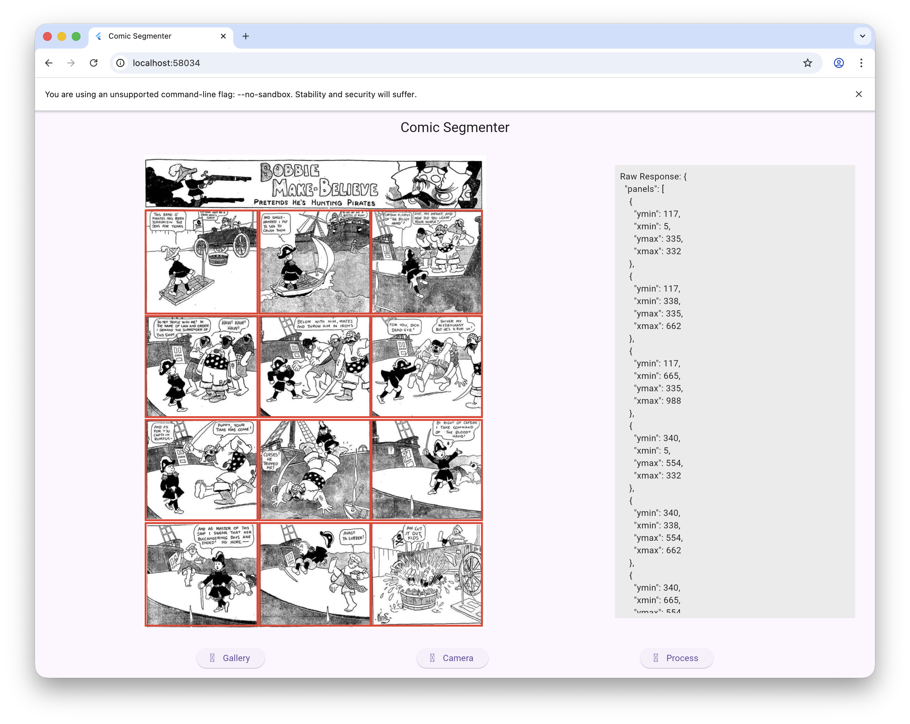

# Comic Page Segmentation

A Flutter application that uses Google's Gemini AI to automatically detect and
segment panels in comic book pages.

## Features

-   **AI-Powered Segmentation**: Uses the `gemini-3-pro-preview` model via
    `dartantic_ai` to analyze comic pages.
-   **Visual Feedback**: Draws red bounding boxes around detected panels
    overlaid on the original image.
-   **Developer Tools**: Displays the raw JSON response from the LLM.
-   **Cross-Platform**: Tested on macOS and Web.



## Running the App

To run the application, you must provide your Gemini API key using the
`--dart-define` flag.

### VS Code
Update your `.vscode/launch.json` configuration:

```json
{
    "name": "plasma-disk",
    "request": "launch",
    "type": "dart",
    "args": [
        "--dart-define=GEMINI_API_KEY=${env:GEMINI_API_KEY}"
    ]
}
```

### Terminal
```bash
flutter run --dart-define=GEMINI_API_KEY=YOUR_ACTUAL_API_KEY
```
